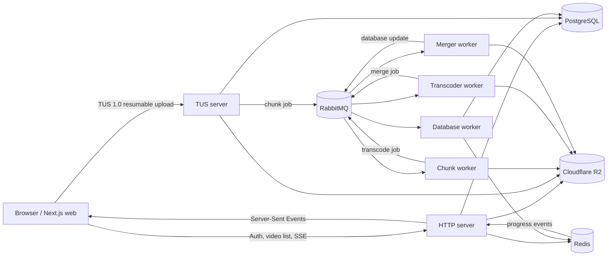

# Transcoder

Transcoder is a self-hosted, asynchronous video-upload and transcoding platform. It accepts resumable uploads, stores source and intermediate media in Cloudflare R2, creates multiple output resolutions with FFmpeg, and publishes live progress to the web dashboard.

## Architecture



The browser uses the HTTP API for authentication, video records, and progress events. Large media uploads use the TUS server directly, so an interrupted upload can resume with the same upload URL and offset.

PostgreSQL is the durable source of truth for users, videos, and generated formats. Redis holds short-lived progress and cancellation state. RabbitMQ separates each CPU- and I/O-intensive stage so upload traffic is not blocked by FFmpeg work. Cloudflare R2 stores original files, chunks, intermediate renditions, and final media.

## How a video is processed

A video upload is created through the TUS server. The server accepts `POST`, `HEAD`, `PATCH`, and `DELETE` requests from the TUS protocol, tracks the upload offset, and writes uploaded data to R2. When the upload is complete, it records the video and publishes a chunking job to RabbitMQ.

The chunk worker downloads the source from R2, splits it into processing chunks, updates progress in Redis, and publishes a transcoding job. The transcoder worker runs FFmpeg for the requested output resolutions. The merger worker concatenates each resolution into a final MP4, uploads it to R2, and publishes a completion event. Finally, the database worker persists output URLs and status, clears temporary progress, and makes the completed video visible in the dashboard.

Users can cancel in-progress processing, and the services clear the associated transient Redis state. Worker failures are retried through RabbitMQ; persistent failures can be directed to the dead-letter queue for inspection.

## Critical paths and reliability

### R2 media movement

R2 is the durable media store at every processing boundary. The worker writes source segments under `chunks/<video-id>/chunk_<n>.mp4`; each transcoder writes its rendition under `transcoded/<video-id>/<resolution>/chunk_<n>.mp4`; and the merger writes the completed asset under `final/<video-id>/<resolution>.mp4`. Local files are temporary worker scratch data and are deleted after successful upload or merge.

The object keys are deterministic. If an at-least-once delivery repeats work after a worker restart, the same key is rewritten instead of creating another media object. PostgreSQL, not Redis, remains the durable record of completed output URLs.

### Independent chunk processing

After source chunking, every `(video ID, resolution, chunk index)` combination is an independent transcode job. For example, 20 input chunks requested at five resolutions create 100 jobs that can run across worker replicas. The transcoder has a local concurrency limit so one process does not exhaust CPU or disk, while RabbitMQ distributes the remaining jobs to available consumers.

The database worker records each completed chunk index in a Redis set scoped to the video and resolution. When the set contains the expected number of distinct chunk indexes, it publishes a merge job for that resolution. This allows one missing or failed chunk to block only its own rendition, rather than the entire pipeline.

### Ordered merge

Merge work is deliberately not parallel within one final rendition. The merger downloads `chunk_1` through `chunk_n` in numeric order, builds an FFmpeg concat manifest, and uses stream copy (`-c copy`) to create the final MP4 without another full encode.

For stream-copy concatenation to be reliable, all chunks for one resolution must have compatible codecs, stream layout, time base, and encoding settings. Source segments should also start at keyframes; otherwise a player can show artifacts or timing discontinuities at a chunk boundary. This is a media-validity requirement, not something RabbitMQ can correct.

### Retry and dead-letter behavior

Chunking, transcoding, merging, and database-update consumers track retry counts in Redis. A failed job is requeued up to three times; after the limit, the worker publishes a diagnostic payload to `dead-letter-queue` and acknowledges the source message. RabbitMQ connection establishment uses exponential backoff from one to thirty seconds.

The system is at-least-once, not exactly-once: a process can publish downstream work and crash before acknowledging its own message. Deterministic R2 keys and Redis sets reduce duplicate effects, but consumers must remain idempotent. The merge trigger should be protected by an atomic `SET NX`-style "merge started" key so repeated completion events cannot schedule duplicate merge jobs. Retries are currently immediate; a delayed retry queue is preferable in production to prevent rapid retries against an unavailable dependency.

## Components

| Component | Responsibility |
| --- | --- |
| `apps/web` | Next.js dashboard, authentication UI, Uppy/TUS upload client, progress and output views |
| `apps/http-server` | Axum REST API for authentication, video metadata, signed R2 multipart operations, and Server-Sent Events |
| `apps/tus-server` | TUS 1.0 resumable-upload endpoint and upload-job publisher |
| `apps/worker` | Source-file chunking and chunk-job processing |
| `apps/transcoder` | FFmpeg transcoding into requested resolutions |
| `apps/merger` | Concatenates transcoded chunks and uploads final media |
| `apps/db-worker` | Applies asynchronous status/output updates and publishes progress state |
| `packages/db` | Diesel models, migrations, and PostgreSQL connection pool |
| `packages/redis-conn` | Redis pools plus progress and cancellation helpers |
| `packages/rabbitmq-conn` | Durable RabbitMQ connection and queue declarations |
| `packages/s3-conn` | Cloudflare R2/S3-compatible client configuration |

## Queues and state

The pipeline uses durable RabbitMQ queues. The default names are `chunk-queue`, `transcode-jobs`, `merge-jobs`, `db-updates`, and `dead-letter-queue`. Queue names may be configured per deployment, but every producer and consumer for a stage must use the same name.

Redis is not the source of truth for completed video data. It is used for live progress, cancellation, and short-lived coordination. The database worker persists the final state in PostgreSQL, which is what the API returns after a reconnect or restart.

## Local development

Requirements: Rust stable, Bun, Docker Compose, FFmpeg, PostgreSQL, Redis, RabbitMQ, and Cloudflare R2-compatible development credentials.

Create local environment files from the checked-in examples. Do not commit `.env` files or production credentials.

```bash
docker compose up --build
```

Common local endpoints:

- Web dashboard: `http://localhost:3000`
- HTTP API: `http://localhost:3001`
- TUS upload endpoint: `http://localhost:1081/files/`

Run the frontend separately when you need hot reload:

```bash
bun install
bun --cwd apps/web dev
```

## Validation

Run focused checks before opening a pull request:

```bash
cargo check --workspace
cargo test --workspace
bun --cwd apps/web run lint
bun --cwd apps/web run build
docker compose config
```

The worker services require access to Redis, RabbitMQ, PostgreSQL, R2, and FFmpeg for end-to-end testing. Unit and compile checks do not upload media or alter production infrastructure.
